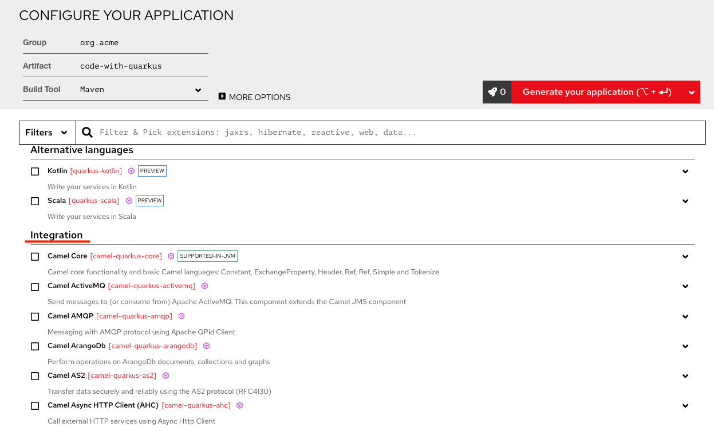
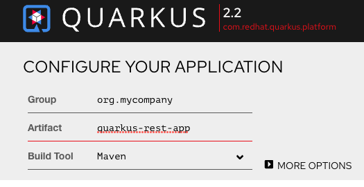
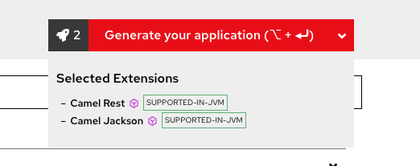
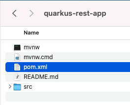
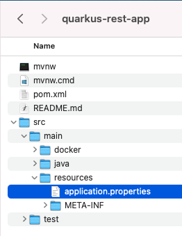
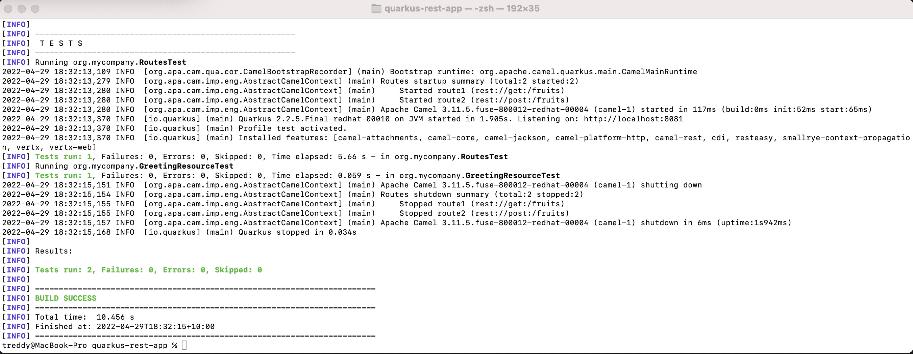

:labname: Camel Extensions for Quarkus

include::../include/00_0_Lab_Header.adoc[]

== {labname} Lab

:numbered:

== Introduction to Camel Extensions for Quarkus

This project aims to bring the awesome integration capabilities of Camel and its vast component library to the Quarkus runtime.  Ite nables users to take advantage of the performance benefits, developer joy and the container first ethos that Quarkus provides.  Camel Extension for Quarkus provides Quarkus extensions for many of the Camel components.

The Y22Q1 release of Red Hat^(R)^ Integration includes the Camel Extensions for Quarkus features:

* Fast startup and low RSS memory
** Using the optimized build-time and ahead-of-time (AOT) compilation features of Quarkus, your Camel application can be pre-configured at build time resulting in fast startup times.
* Application generator
** Use the Quarkus application generator to bootstrap your application and discover its extension ecosystem.
* Highly configurable
** All of the important aspects of a Camel Extensions for Quarkus application can be set up programmatically with CDI (Contexts and Dependency Injection) or via configuration properties.
* Integrates with existing Quarkus extensions
** Camel Extensions for Quarkus provides extensions for libraries and frameworks that are used by some Camel components which inherit native support and configuration options.

.Goals

* Creating the skeleton application using `code.quarkus.redhat.com`
* Adding a simple Camel route
* Exploring the application code
* Compiling the application in development mode
* Testing the application
* Packaging and running the application

== Generating the skeleton application

Projects can be bootstrapped and generated at code.quarkus.redhat.com. The Camel Extensions for Quarkus extensions are located under the 'Integration' heading.

Use the 'search' field to find the extensions that you require.

Select the component extensions that you want to work with and click the 'Generate your application' button to download a basic skeleton project. There is also the option to push the project directly to GitHub.

In this section you will be creating a skeleton application that would be later used to implement a Camel REST service:

.Procedure

. Open your browser and navigate to `code.quarkus.redhat.com`
. In the 'CONFIGURE YOR APPLICATION' section of the page, complete the following:
.. For `Group` type in `org.mycompany``
.. For `Artifact` type in `quarkus-rest-app`
.. Ensure that the `Build Tool`` is selected as `Maven`
+

. Within the filter text box, type in `camel-quarkus-rest` and select `Camel Rest` extension
. Type in `camel-quarkus-jackson` and select `Camel Jackson` extension
. Locate the `Generate your application` option on the screen and click on the grey box with a rocket icon on it.  Confirm that the above two Camel Extensions are present.
+

+
[NOTE]
The extensions selected are required to enable us to build a Camel REST service.

. Click the `Generate your application` option and then click 'DOWNLOAD THE ZIP' button to save the skeleton application to your machine.
+
image::images/application-generator-download-applicationimage::images/

== Explore the application code

In this section you will explore the contents of the skeleton application that you have created in the previous exercise:

.Procedure

. Navigate to the directory where you have downloaded your application and unzip the file to your preferred location.
. Once extracted, open the `quarkus-rest-app` folder and select the file `pom.xml`
+

+
.. The application has two compile dependencies which are managed within the `com.redhat.quarkus.platform:quarkus-camel-bom` that is imported in `<dependencyManagement>`.:
+
[source,xml]
----
<quarkus.platform.artifact-id>quarkus-bom</quarkus.platform.artifact-id>
<quarkus.platform.group-id>com.redhat.quarkus.platform</quarkus.platform.group-id>
<quarkus.platform.version>
    <!-- The latest 2.2.x version from https://maven.repository.redhat.com/ga/com/redhat/quarkus/platform/quarkus-bom -->
</quarkus.platform.version>
...
<dependency>
    <groupId>${quarkus.platform.group-id}</groupId>
    <artifactId>${quarkus.platform.artifact-id}</artifactId>
    <version>${quarkus.platform.version}</version>
    <type>pom</type>
    <scope>import</scope>
</dependency>
<dependency>
    <groupId>${quarkus.platform.group-id}</groupId>
    <artifactId>quarkus-camel-bom</artifactId>
    <version>${quarkus.platform.version}</version>
    <type>pom</type>
    <scope>import</scope>
</dependency>
----
+
[NOTE]
For more information about BOM dependency management, see https://access.redhat.com/documentation/en-us/red_hat_integration/2022.q1/html-single/developing_applications_with_camel_extensions_for_quarkus/index[Developing Applications with Camel Extensions for Quarkus]

.. Locate the two Camel Extensions selected when you were creating the skeleton application.  These should be present as Maven dependencies under the `<dependencies>` xml tag.`
+
[source,xml]
----
<dependency>
    <groupId>org.apache.camel.quarkus</groupId>
    <artifactId>camel-quarkus-jackson</artifactId>
</dependency>
<dependency>
    <groupId>org.apache.camel.quarkus</groupId>
    <artifactId>camel-quarkus-rest</artifactId>
</dependency>
----

. Navigate to `src/main/resources` and select the file `application.properties`
+

+
The application can be configured by properties defined within this file, for example the `camel.context.name` can be set there.

== Adding a simple Camel route

In this section you will update the application to create a simple Camel route exposing a REST service:

. Create a file named `Routes.java` in the `src/main/java/org/mycompany/` subfolder.
. Copy the below code snippet and paste it into the `Routes.java` file:
+
[source,java]
----
package org.mycompany;

import java.util.Arrays;
import java.util.List;
import java.util.Objects;
import java.util.concurrent.CopyOnWriteArrayList;

import org.apache.camel.builder.RouteBuilder;
import org.apache.camel.model.rest.RestBindingMode;

import io.quarkus.runtime.annotations.RegisterForReflection;

public class Routes extends RouteBuilder {
    private final List<Fruit> fruits = new CopyOnWriteArrayList<>(Arrays.asList(new Fruit("Apple")));

    @Override
    public void configure() throws Exception {
        restConfiguration().bindingMode(RestBindingMode.json);

        rest("/fruits")
                .get()
                .route()
                .setBody(e -> fruits)
                .endRest()

                .post()
                .type(Fruit.class)
                .route()
                .process().body(Fruit.class, (Fruit f) -> fruits.add(f))
                .endRest();

    }

    @RegisterForReflection // Let Quarkus register this class for reflection during the native build
    public static class Fruit {
        private String name;

        public Fruit() {
        }

        public Fruit(String name) {
            this.name = name;
        }

        public String getName() {
            return name;
        }

        public void setName(String name) {
            this.name = name;
        }

        @Override
        public int hashCode() {
            return Objects.hash(name);
        }

        @Override
        public boolean equals(Object obj) {
            if (this == obj)
                return true;
            if (obj == null)
                return false;
            if (getClass() != obj.getClass())
                return false;
            Fruit other = (Fruit) obj;
            return Objects.equals(name, other.name);
        }

    }

}
----
+
[NOTE]
The route defines a REST endpoint `/fruits` with two methods (GET and POST) as well as an inner class used for Object->JSON and JSON->Object conversions.

. Save the file

== Development mode

In this section you will compile and start your application:

.Procedure

. In a terminal, navigate to the quarkus-rest-app folder.
. Enter the command `mvn clean compile quarkus:dev` and press enter
+
[NOTE]
This command compiles the project, starts your application and lets the Quarkus tooling watch for changes in your workspace. Any modifications in your project will automatically take effect in the running application.
. In a browser, navigate to http://localhost:8080/fruits.  You should see the following json being returned:
+

[source,json]
----
[
    {
        "name": "Apple"
    }
]
----

. Open the file Routes.java and locate the line below:
+

[source,java]
----
private final List<Fruit> fruits = new CopyOnWriteArrayList<>(Arrays.asList(new Fruit("Apple")));
----

. Change the word `Apple` to `Orange` and save the file.
. Have a look at the terminal where you are running the application.  Notice the live reload of the application:
[source,text]
----
2022-04-29 18:22:42,952 INFO  [io.qua.dep.dev.RuntimeUpdatesProcessor] (Timer-0) Live reload total time: 0.762s
----
. Switch back to the browser and refresh the page.  Notice the updated payload returned:
+

[source,json]
----
[
    {
        "name": "Orange"
    }
]
----
. Switch back to the terminal and terminate the application using `CTRL+C`

== Testing

To test the Camel Rest route that we have created in JVM mode, you can add a test class as follows:

.Procedure

. Create a file named `RoutesTest.java` in the `src/test/java/org/mycompany/` subfolder.
. Add the `RoutesTest` class as shown in the following code snippet:
+

[source,java]
----
package org.mycompany;

import io.quarkus.test.junit.QuarkusTest;
import org.junit.jupiter.api.Test;

import static io.restassured.RestAssured.given;
import org.hamcrest.Matchers;

@QuarkusTest
public class RoutesTest {

    @Test
    public void testFruitsEndpoint() {

        /* Assert the initial fruit is there */
        given()
                .when().get("/fruits")
                .then()
                .statusCode(200)
                .body(
                        "$.size()", Matchers.is(1),
                        "name", Matchers.contains("Orange"));

        /* Add a new fruit */
        given()
                .body("{\"name\": \"Pear\"}")
                .header("Content-Type", "application/json")
                .when()
                .post("/fruits")
                .then()
                .statusCode(200);

        /* Assert that pear was added */
        given()
                .when().get("/fruits")
                .then()
                .statusCode(200)
                .body(
                        "$.size()", Matchers.is(2),
                        "name", Matchers.contains("Orange", "Pear"));
    }

}
----
. To run the test, enter the command `mvn clean test` in a terminal in the project folder.  The JVM mode tests are run by maven-surefire-plugin in the test Maven phase.
. Confirm that the test is successful:
+

== Package and run the application

In this section you will use Maven to package and run your new application.

.Procedure

. In a terminal navigate to the the quarkus-rest-app folder
. Run the follwowing command `mvn clean package`.  The command prepares a thin jar for running on a stock JVM.
. To run the application, execute the command `java -jar target/quarkus-app/quarkus-run.jar`
. Notice the considerably quick boot time:
+

[source,text]
----
2022-04-29 19:22:29,393 INFO  [io.quarkus] (main) quarkus-rest-app 1.0.0-SNAPSHOT on JVM (powered by Quarkus 2.2.5.Final-redhat-00010) started in 1.022s. Listening on: http://0.0.0.0:8080
----

== Summary

Congratulations, you have finished the lab. Here is a recap:

* You used the Quarkus Application Generator to create a skeleton application with Camel Extensions to create a REST service
* You examined the code and identified sections in the POM file which handle compilation and Camel Extension dependencies
* You created a simple Camel route exposing a REST service
* You ran the application in development mode and automatically updated your application with changes
* You tested the application usig a QuarkusTest class
* Finally, you packaged and ran your application

You are ready to go to the next lab, or you can spend some time exploring these aspects of *Camel Extensions for Quarkus* on your own.
